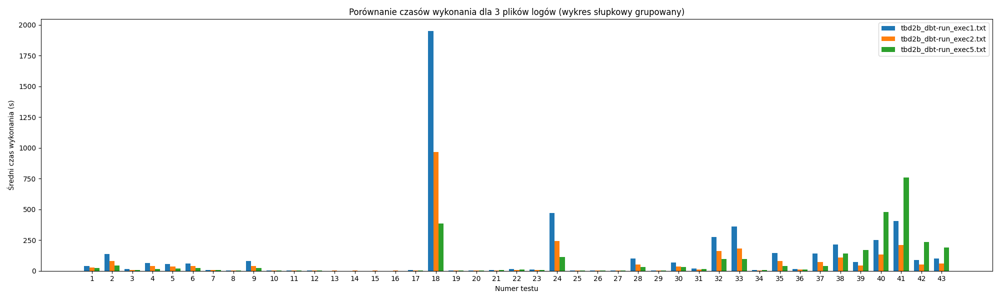
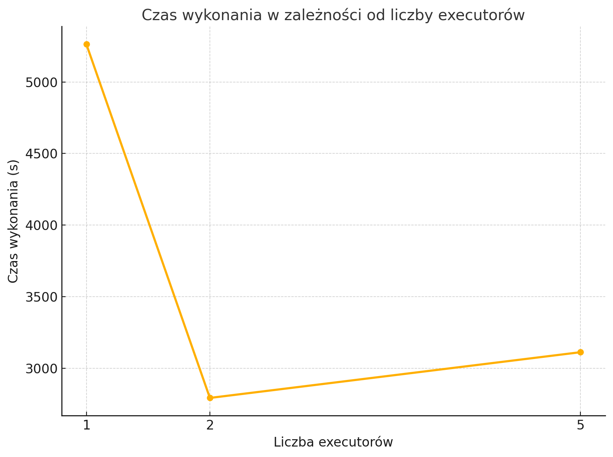

0. The goal of phase 2b is to perform benchmarking/scalability tests of sample three-tier lakehouse solution.

1. In main.tf, change machine_type at:

```
module "dataproc" {
  depends_on   = [module.vpc]
  source       = "github.com/bdg-tbd/tbd-workshop-1.git?ref=v1.0.36/modules/dataproc"
  project_name = var.project_name
  region       = var.region
  subnet       = module.vpc.subnets[local.notebook_subnet_id].id
  machine_type = "e2-standard-2"
}
```

and subsititute "e2-standard-2" with "e2-standard-4".

2. If needed request to increase cpu quotas (e.g. to 30 CPUs): 
https://console.cloud.google.com/apis/api/compute.googleapis.com/quotas?project=tbd-2023z-9918

3. Using tbd-tpc-di notebook perform dbt run with different number of executors, i.e., 1, 2, and 5, by changing:
```
 "spark.executor.instances": "2"
```

in profiles.yml.

4. In the notebook, collect console output from dbt run, then parse it and retrieve total execution time and execution times of processing each model. Save the results from each number of executors. 


Exec 1: Finished running 43 table models in 1 hours 27 minutes and 44.88 seconds (5264.88s)

Exec 2: Finished running 43 table models in 0 hours 46 minutes and 32.22 seconds (2792.22s)

Exec 5: Finished running 43 table models in 0 hours 51 minutes and 51.85 seconds (3111.85s)


5. Analyze the performance and scalability of execution times of each model. Visualize and discucss the final results.



Korzystając z dwóch executorów zamiast jednego, zauważamy wyraźny wzrost wydajności. Natomiast przejście na pięć executorów nie zwiększa już tak znacząco efektywności, za to istotnie podnosi koszty. Różnice trudno przedstawić w formie wizualizacji, ale potwierdzają je czasy wykonania.
Co ciekawe dla ostatnich testów wydajność 5 executorów znacząco spadła wydłużając tym samym czas wykonania testu.

Obserwując czas wykonania najszybciej wykonuje się na 2, więc koszt jest zdecydowanie większy a zysk czasowy ujemny, więc najelpiej w tym przypadku pozostać na 2 executorach.

